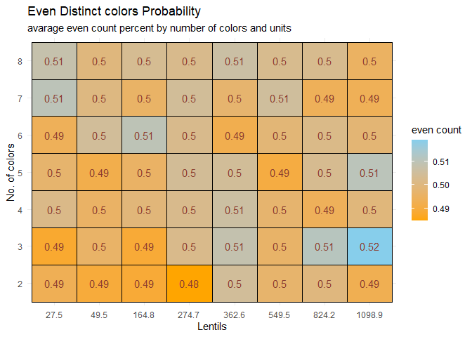

My M&M OCD
================
Yoni
17 04, 2025

# Intro

### Objective of Simulation

This simulation explores the fairness and randomness in the color
distribution of M&M-style chocolate candies. Specifically, it
investigates:

1.  How often are M&M packs evenly distributed across all colors?

2.  What’s the probability of a pack missing at least one color?

3.  How do the number of candies and available colors impact that
    probability?

As a chocolate fan, I’ve always wondered:

    *  Can I finish a pack of M&Ms eating two at a time, without ever mixing colors in a bite?

This playful question leads to a deeper statistical exploration of
random sampling, distribution fairness, and packaging quality in candy
production.

### Method

Since production data from [M&M](https://www.mms.com/en-us) isn’t
publicly available, I simulate packages based on common retail sizes and
the standard 6-color set. Each simulation randomly draws a sample of
candies, assigning each a color. We repeat this process hundreds of
times to analyze statistical properties across “virtual” packages.

Through this approach, I estimate the probability of:

1.  Getting a “perfect” pack (equal counts for each color)

2.  Receiving a pack missing at least one color

3.  Seeing how these probabilities shift with pack size or color variety

### Parameters

Basic parameters:

We define a “pack” as a vector of integers representing the count of
each color.  
Each simulation uses random sampling with replacement to mimic
real-world packaging.  
Key variables:

- `n-color`: Number of distinct colors

- `n-unit`: Total candies in the pack

``` r
#parameters
n= 800              #numbers of bags per sample
n_color= 6          #unique colors of M&M
gram= 0.91          #weight of one M&M
bag_g= 250          #common weight of M&M package
n_unit= bag_g/gram  #M&M per packagenm,
```

    ## [1] "The avarage number of lentils per color is 45.8"

# Creating the Sample

## General Sample

In order to test the theoretical data, I need to simulate it using
customize functions. here are there:

- `Create_bag`- function to create one snack package for chosen package
  size and number of colors.

- `sample_MnM`- function to create n bags from the Create_bag function.

key parameters for `sample_MnM`

- `n`: Number of packages in the sample

- `x_units`: Total candies in each package

- `n_colors`: Number of distinct colors in each package

<!-- -->

    ## [1] "One bag of 100:"

    ##       1  2  3  4  5  6
    ## [1,] 17 20 15 13 16 20

    ## [1] "3 bags of 100:"

    ##       Red Blue Green Orange Yellow Brown
    ## Bag_1  21   10    17     17     18    17
    ## Bag_2  17    9    14     20     24    16
    ## Bag_3  17   22    19     17     18     8

## Preview Graph

Now will be creating n bugs of M&M

columns:

1.  `V1:V6`- the number of lentils per color

2.  `even_count`- how many evens colors there are

3.  `even_evens`- are the uneven colors even

4.  `low_col`- sum true if one color’s count is lower than $\frac{2}{3}$
    of expected value

5.  `Variance`- variance of lentils per color

6.  `min`- the lowest color in each row

7.  `all_even`- are all colors even

here are the first rows:

| Red | Blue | Green | Orange | Yellow | Brown | even_count | even_evens | low_col | Variance | min | all_even |
|---:|---:|---:|---:|---:|---:|---:|:---|---:|---:|---:|:---|
| 40 | 52 | 50 | 51 | 38 | 43 | 4 | TRUE | 0 | 37.07 | 38 | FALSE |
| 51 | 54 | 52 | 38 | 44 | 35 | 4 | TRUE | 0 | 62.67 | 35 | FALSE |
| 46 | 37 | 48 | 42 | 43 | 58 | 4 | TRUE | 0 | 50.67 | 37 | FALSE |
| 54 | 28 | 53 | 45 | 48 | 46 | 4 | TRUE | 1 | 88.27 | 28 | FALSE |

M&M sample random rows

I summarized the sample by color bellow

|        | Min. | 1st Qu. | Median |     Mean | 3rd Qu. | Max. |   Var |
|:-------|-----:|--------:|-------:|---------:|--------:|-----:|------:|
| Red    |   29 |      42 |     46 | 45.86125 |      50 |   67 | 33.56 |
| Blue   |   27 |      42 |     46 | 45.66000 |      50 |   65 | 36.47 |
| Green  |   30 |      42 |     46 | 45.79500 |      50 |   70 | 39.29 |
| Orange |   28 |      42 |     46 | 45.91250 |      50 |   64 | 37.53 |
| Yellow |   28 |      42 |     46 | 45.78000 |      50 |   64 | 36.34 |
| Brown  |   28 |      42 |     45 | 45.49875 |      50 |   63 | 35.81 |

summary of all colors Distibution

Here we can see the distribution of all colors to be even and of one
example color (red)

<!-- -->

## Statisics Checking of the Simullation

### Test Expected Value

In order to see is the $\mu$ of the lentils per color are fair, I will
test it per column with t.test for each color.

Here is the result, none of them bellow 5% P. value

p.value of $H_0: \mu= \frac{n-unit}{n-color}$

    ##      Red     Blue    Green   Orange   Yellow    Brown 
    ## "71.90%" "55.04%" "97.32%" "56.42%" "97.18%" "17.26%"

Now I will do the same checking for 2 samples, to see whether there is
correlation between each 2 colors distribution.

for each row i and column j

1)  if i==j, this it the check from before of the expected value to
    n_unit/n_color

2)  if i!=j, this is two samples test of same expected value hypothesis

<!-- -->
Now here Is visualization of the actual data per color

<!-- -->

### Variance Distribution Checking

I know that the distribution of variance is approximately Gamma
distribution:

$$f(x) = \frac{1}{\Gamma(\alpha)\theta^\alpha} x^{\alpha-1}e^{-x/\theta}$$

I can see that the variance distribution is Gamma like with shape and
rate as seen below

    ## [1] "The parameters of the gamma shaped variance is shape 2.464 and scale 17.759"

<!-- -->

### Are All Even in the Sample?

<!-- -->

## Multiple Types of Samples

I will create a function that create sample for each number of colors
and package size I want, and then calculate some interesting parameters

I will make the multiple sample. parameters:

``` r
n_color<- 2:8 #Number of distinct colors in each package option
grams_op<- c(25,45,150,250,330,500,750,1000) #Weight of each package option
n_unit_op<- grams_op/gram #Total candies in each package option
nn<- 800 #Number of packages in the sample
```

Here is some random rows:

| n_unit | n_color | even_count | even_evens | var_col | all_even | low_color | smallest_col |
|-------:|--------:|-----------:|-----------:|--------:|---------:|----------:|-------------:|
|  164.8 |       7 |      0.499 |      0.071 |  22.837 |    0.010 |     0.069 |           10 |
|   27.5 |       4 |      0.519 |      0.125 |   7.151 |    0.075 |     0.285 |            0 |
|   27.5 |       5 |      0.495 |      0.096 |   5.446 |    0.024 |     0.336 |            0 |
|   27.5 |       6 |      0.498 |      0.082 |   4.332 |    0.010 |     0.544 |            0 |
| 1098.9 |       2 |      0.502 |      0.271 | 535.494 |    0.272 |     0.000 |          497 |

Multiple sample example rows

### 🔬Deep Insight on the Data

Here are some insights:

<!-- -->

<!-- -->

Here is probability of all even, and whether there is pattern.

<!-- -->

<!-- -->
Here we can see the smallest % of Lentils in one color as seen in my
sample:

<!-- -->

As we can see, only the small package (less than 50 lentils) have high
probability of at least one color to appear severely lower.

Therefore, splitting package by color on the big ones should be
relatively even.

### Using Regression for Correlation Check

I wanted to see if there is statistic correlation of the number of
distinct colors of package size to the probability of all colors been
even. as a result, I chose to check this claim with regression.
Furthermore, I did the same regression adding another potential
correlated parameter: the evenness of the number of distinct colors.

    ## 
    ## ==============================================
    ##                       Dependent variable:     
    ##                   ----------------------------
    ##                             all_even          
    ##                        (1)            (2)     
    ## ----------------------------------------------
    ## n_color              -19.195        -9.645    
    ##                    (1,538.969)     (806.794)  
    ##                                               
    ## n_unit                -0.001        -0.001    
    ##                      (0.001)        (0.001)   
    ##                                               
    ## color_No2                           11.589    
    ##                                   (4,341.690) 
    ##                                               
    ## Constant              37.414         6.725    
    ##                    (3,077.938)    (4,904.858) 
    ##                                               
    ## ----------------------------------------------
    ## Observations          1,320          1,320    
    ## Log Likelihood       -61.974        -61.974   
    ## Akaike Inf. Crit.    129.949        131.949   
    ## ==============================================
    ## Note:              *p<0.1; **p<0.05; ***p<0.01

As you can see, there is a strong correlation negative of the number of
colors to probability of all colors to be even, as expected. In
addition, we find out that if the number of colors is even, the
probability of all distinct colors to be even increase.

Seeing the $2_{nd}$ regression we can suggest that more colors is
correlated with 1.3% less probability of all colors even, while even
numbers of colors is correlated with 4.7% more probability of all colors
eve, regardless of any package size.

    ## 
    ## =======================================================
    ##                            Dependent variable:         
    ##                   -------------------------------------
    ##                   cbind(n_color, n_color - even_count) 
    ##                          (1)                (2)        
    ## -------------------------------------------------------
    ## n_color                 0.002              0.002       
    ##                        (0.006)            (0.006)      
    ##                                                        
    ## n_unit                 -0.00002           -0.00002     
    ##                        (0.0001)           (0.0001)     
    ##                                                        
    ## color_No2               0.007                          
    ##                        (0.037)                         
    ##                                                        
    ## Constant               0.694***           0.697***     
    ##                        (0.063)            (0.061)      
    ##                                                        
    ## -------------------------------------------------------
    ## Observations            1,320              1,320       
    ## Log Likelihood        -1,903.509         -1,903.526    
    ## Akaike Inf. Crit.     3,815.019          3,813.052     
    ## =======================================================
    ## Note:                       *p<0.1; **p<0.05; ***p<0.01

Unlike the previous regression, the second regression that examines the
correlation of the number of colors and package size to the percentage
of even numbers did not find a statistically significant correlation.

# Summary

### Data Structure

The simulation created a random samples of snack packs, which was proven
to be statistically random with known $\mu$ and $\sigma^2$. I created
one sample with specific size and numbers of colors using “sample_MnM”,
and costume multiple samples using “mega_snack”. Then, I check the
relevand indicators fot this project.

I found out that:

- Small packages often lack at least one color, and sometimes contain
  only one color.

- As the number of colors increases, the chance that all colors have
  even counts drops significantly.

- For medium to large packages, the probability of any one color being
  significantly underrepresented (less than $\frac{2}{3}$ of its
  expected amount) is near zero.

suggestion for any random sampler factory (like candies, lego, toys):

1.  Smaller packages need more diversity check

2.  Althernatively, I would recomand calculate the amount of each type
    in small packages

### Main Q: Eating M&M by Two

Although there is no clear pattern to the right M&M package for all the
colors to have even count, different approach might find a clear reason
for more or less couples of M&M. Here is what I did found:

The general probability of all colors to be even in 6 colored pack is
1.5% for small 50g package 2.1% for big 1000g package, and overall 1.5%,
which is more than I expected.

For 5 colored pack like Skittles the average is about 2.9%

For 2 colored pack the average is 24.5%, so for 2 colored marshmallow
bag this will be the statistics.

See all here:

| Colors | All Even Percent |
|-------:|-----------------:|
|      2 |            24.89 |
|      3 |            12.58 |
|      4 |             6.33 |
|      5 |             2.61 |
|      6 |             1.30 |
|      7 |             0.78 |
|      8 |             0.22 |

Probability of All Colors Even by Pack Colors Number

### Conclusions

To sum it up, for each medium pack the probability of all even colors is
1.4%, or 1 in a 73 packs of 250g. So I might need to change my snack
preference to marshmallow if I want to keep this method.

This project allowed me to implement simulation methods in response to a
real (albeit silly) question, and evaluate it statistically from end to
end..

I applied:

- Simulation by demand

- Exploratory analysis

- Hypothesis testing

- Distribution checks

- Outliers detection

- Visualization using R

In addition, I created the infrastructure for similar questions with
different parameters to be checked in a reusable, structured way.
